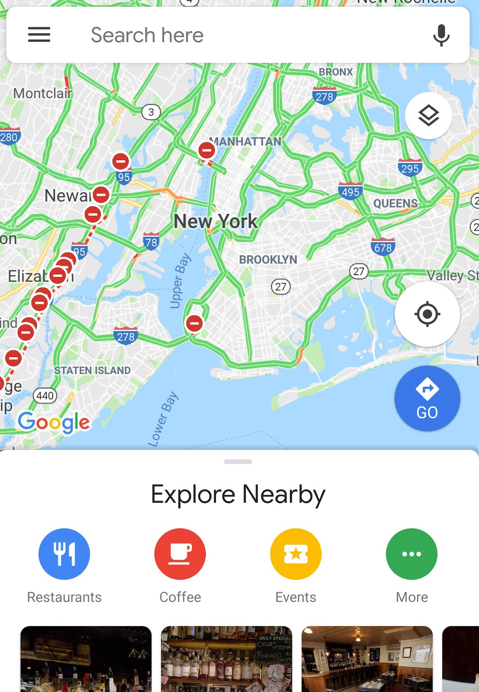

Google Mapで下から引っ張ると出てくるやつ。



調べたら以外と簡単にできた。

dependenciesを追加。

```
dependencies {
    implementation 'com.google.android.material:material:1.0.0'
}
```

例

```xml
<androidx.coordinatorlayout.widget.CoordinatorLayout ..... >
 <LinearLayout
        android:id="@+id/bottomSheetLayout"
        android:layout_width="match_parent"
        android:layout_height="match_parent"
        app:behavior_hideable="false"
        app:behavior_peekHeight="56dp"
        app:layout_behavior="@string/bottom_sheet_behavior">
 中身
</LinearLayout>
</androidx.coordinatorlayout.widget.CoordinatorLayout>
```

bottm sheetにしたいコンテンツ、今回の例ではLinearLayout、のlayout_behaviorを以下のように指定。  

`app:layout_behavior="@string/bottom_sheet_behavior`  

CoordinatorLayoutの一番下に配置する。  

開いたり閉じたりをコードで制御する場合は、activity/fragmentの中で以下のように設定する。

```kotlin
bottomSheetBehavior = BottomSheetBehavior.from(bottomSheetLayout)


// 隠す
bottomSheetBehavior.state = BottomSheetBehavior.STATE_COLLAPSED

// 開く
bottomSheetBehavior.state = BottomSheetBehavior.STATE_EXPANDED
```

コールバックも設定できる。  

```kotlin
 bottomSheetBehavior.setBottomSheetCallback(object: BottomSheetBehavior.BottomSheetCallback(){
            override fun onSlide(p0: View, p1: Float) {
                TODO("not implemented") //To change body of created functions use File | Settings | File Templates.
            }

            override fun onStateChanged(p0: View, p1: Int) {
                TODO("not implemented") //To change body of created functions use File | Settings | File Templates.
            }

        })
```

参考  
https://blog.mindorks.com/android-bottomsheet-in-kotlin  
https://qiita.com/fumiyakawauso/items/1d0fa27aa508a3e0570a  


