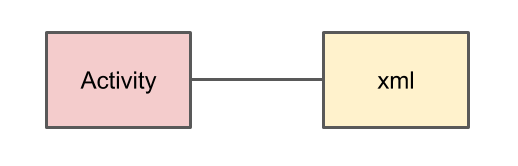

これまでフロントエンド/バックエンドしか作ったことなく、ようやくAndroid開発に入門したのだが、  
始めのころの情報収集が意外と大変だったので、同じような境遇の人の為にまとめておく。  

上からみていくと、フロントエンド/バックエンドしか開発したことがなくても、流れが掴みやすいかと  

## ライブラリ
Android 9.0(API 28)以降では、Android Xというライブラリを使っていく。   
Android Xは、Android Jetpackという、ライブラリ群の1部らしい。  

Android Jetpackとは、  
> Jetpack は、高品質の Android アプリをデベロッパーが簡単に作成するための一連のライブラリ、ツール、およびガイダンスです。

https://developer.android.com/jetpack?hl=ja  

Jetpackについては、以下の記事が参考になった。  
https://qiita.com/k_masa777/items/c01c1de6ac763ce5c075

検索する際には、古いライブラリの記事が結構出てくるので、Android Xかどうか注意

## アーキテクチャ
MVCやクリーンアーキテクチャなどのアーキテクチャがAndroidでも存在する。  
Model-View-ViewModelで構成されるMVVMという構成が主流っぽい  


View: 画面表示  
ViewModel: Modelから値を取得、Viewに表示する値を管理  
Model: データモデル、ビジネスロジック  

ここでのモデルは、DDDのモデルよりも少し多機能な感じ  

アーキテクチャを一通り紹介していてわかりやすかった。  
https://employment.en-japan.com/engineerhub/entry/2018/01/17/110000  

MVVMの実装する上でわかりやすかった  
https://qiita.com/Tsutou/items/69a28ebbd69b69e51703  

#### コードサンプル
MVVM意外にもクリーンアーキテクチャなど、様々なサンプルがあってわかりやすい  
https://github.com/android/architecture-samples  
https://github.com/android10/Android-CleanArchitecture-Kotlin  

## ロジック
Androidでは、APIを叩く、画面表示する、ホスト(Android端末)のリソースを管理するなど、やることが多い。  
まずは、Webアプリケーションにおける、バックエンドに当たる部分について、まとめる。  

### HTTP Request
http clientは、retrofitというライブラリがよく使われてる様子  
https://square.github.io/retrofit/   

参考  
https://qiita.com/SYABU555/items/3b280a8e81d2cc897383  


### 非同期処理
APIは非同期で実行したい。Androidでは、UIスレッドと呼ばれる、スレッドがメインスレッドとして動作する。  
UIの描画など、UIスレッドで実行しなければならないものがある。  
別スレッドを起動することも可能だが、非同期処理を行いたい場合は、コルーチンを使うのが主流。  

コルーチンは、スレッドを作るより軽量で、中断可能な処理を行えるもの。  

調べると色々出てくるが、使い方については、以下が参考になった。  
https://kotlinlang.org/docs/reference/coroutines/basics.html  
https://qiita.com/kawmra/items/ee4acb7db61f70dec9a8  

### Result
APIのresponseを受け取る際には、成功/失敗をいい感じにハンドリングしたい。  
kotlinでは、Success/Failureの2つの型を持てるResult型が存在する。  

https://satoshun.github.io/2018/12/result/  
https://qiita.com/kencharos/items/6fd0a9e92363b08c0340  

使ったことないけど、Eitherも使えるライブラリもある  
https://arrow-kt.io/  

### DB
Androidでは、SQLiteが使えます。APIをキャッシュするような使い方も可能です。  
Android JetpackにRoomというライブラリがあるので、それを使います。  

単純な使い方はググればいくらでも出てくるので、それ以外の通常の開発に必要なものを羅列します。

オブジェクト間のリレーションを定義する  
https://developer.android.com/training/data-storage/room/relationships?hl=ja  

Roomで1対多を実現する  
https://medium.com/@star_zero/room%E3%81%A71%E5%AF%BE%E5%A4%9A%E3%82%92%E5%AE%9F%E7%8F%BE%E3%81%99%E3%82%8B-fa27615345ba  

型コンバーターを使用する  
https://developer.android.com/training/data-storage/room/referencing-data?hl=ja#type-converters  

特定の列をインデックスに登録する  
https://developer.android.com/training/data-storage/room/defining-data?hl=ja#column-indexing  

#### Androidに保存した、データをみたいとき
Android Studioの(通常)右下にあるDevice File Explorerを選択。  
エミュレーター内のファイルを見ることができるので、`data/ data/“package_name”/databases `にある  
以下のファイル群を保存。  

```
database_name
database_name-shm
database_name-wal
```

SQLite用のクライアントを使って中身を確認することができる。  

クライアント  
https://sqlitebrowser.org/dl/  

## UI
Androidでは、基本的に、Activieにロジックを記述し、Activityとxmlで記述されたlayoutが1対1で対応し1つの画面を構成する。



これでは、Activityが肥大化してしまうので、MVVMでは、1つのActivityに複数の画面(Fragment)を持たせる。  
Acitivtyでは画面の構成、Fragmentでは各画面のロジックのみを持つ。  


また、Fragmentは、 コンポーネントの用に複数のFragmentを用いて、1つの画面を構成するという使い方もできる。  

activityとfragmentはそれぞれ異なるライフサイクルを持ち、  
例えば、画面の回転や、List表示する為のデータの保持などの場合に考慮する必要がある。  

activityのライフサイクル
https://developer.android.com/guide/components/activities/activity-lifecycle?hl=ja#alc

fragmentのライフサイクル
https://developer.android.com/guide/components/fragments?hl=ja#Creating

### Layout
コンポーネントを単純に縦横に並べるだけなら、LinearLayoutで良い。  
細かく指定したい場合は、ConstraintLayoutが便利。  

位置の指定の仕方に始めは、戸惑うが以下がわかれば簡単。   

```
app:layout_constraint[自分の辺]_to[相手の辺]Of="@+id/相手のid"
```

さらに詳しくは、以下の記事が参考になった。  
[Android] ConstraintLayout レイアウト逆引きまとめ  
https://qiita.com/tktktks10/items/62d85dabac4bdb8c1f94  


### データバインディング
Android Jetpackの提供する、データバインディングライブラリを使う。  
Webアプリケーションでは、HTMLとロジック間でデータをバインディングしリアルタイムで表示を変えたりなどを行う。  
データバインディングライブラリを使うことで、同様のことが実現できる。  

データバインディング  
https://developer.android.com/topic/libraries/data-binding/?hl=ja  

### アイコン
```
res > vector > ....
```

でアイコンの追加が行える。  
意外と出てこなくてハマった。  

#### font-awesome使う場合
以下の記事が参考になった  
https://www.androidhive.info/2019/06/use-font-awesome-icons-android/  

https://fontawesome.com/icons?d=gallery  


### アニメーション
メニューのアコーディオンや、移動など単純なアニメーションは、  
`res/anim/sample.xml`を配置し、実現できる。  

移動アニメーションの例  
https://akira-watson.com/android/translate-animation.html   


### Paging
リストを描画し、無限スクロールさせたい場面は多いと思う。  
ViewModelとPaging library、RecyclerViewを使って実現できる。  

以下の記事が参考になった。  

Android Jetpack 初級 ( Paging library + LiveData + Retrofitで、簡単無限スクロール)  
https://qiita.com/Tsutou/items/bae47cf55292f3349284#livedata  

Paging Library + API でページング処理  
https://medium.com/@star_zero/paging-library-api-%E3%81%A7%E3%83%9A%E3%83%BC%E3%82%B8%E3%83%B3%E3%82%B0%E5%87%A6%E7%90%86-5e68543e7031  
https://github.com/STAR-ZERO/paging-retrofit-sample  

コードサンプル  
https://github.com/Tsutou/PagingLiveData  

APIを叩きつつ、DBにキャッシュする例  
https://medium.com/@star_zero/paging-library-api-%E3%83%87%E3%83%BC%E3%82%BF%E8%BF%BD%E5%8A%A0-%E5%89%8A%E9%99%A4-eae42d0853cb  

## firebase
Authenticationやデータベースなどが簡単に使える。  
Googleアカウントでのログインを行いたい場合など便利  

Android プロジェクトに Firebase を追加する   
https://firebase.google.com/docs/android/setup?hl=ja  

## リリース
https://developer.android.com/studio/publish/preparing?hl=ja
