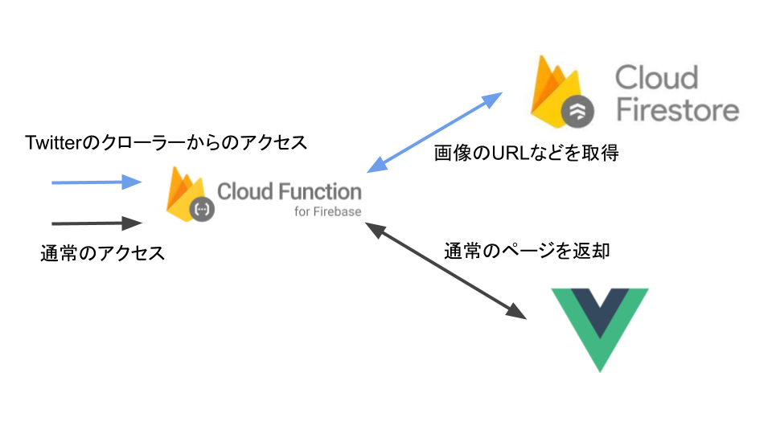
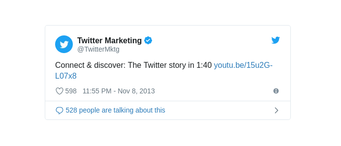
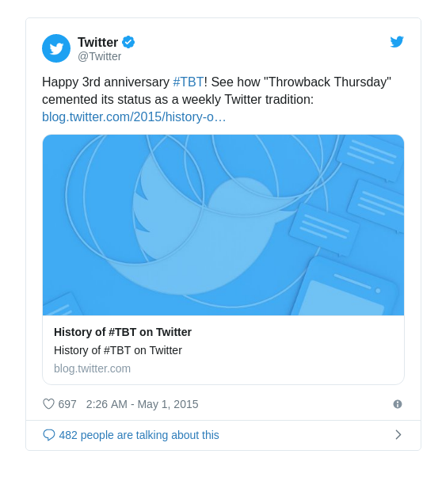

Vue.jsで作ったWebAppをFirebase Hostingで公開し、そこでTwitter用のOGPを設定しようとしましたが、Twitterのクローラーがjavascriptを解釈できないということで、別途方法を考える必要がありました。そこで、Firebase Cloud Functionsを使ってtwitter：OGPを設定してみようと思います。

Firebase Cloud Functionsとは

> Cloud Functions for Firebase を使用すると、Firebase 機能や HTTPS リクエストによってトリガーされたイベントに応じて、バックエンド コードを自動的に実行できます。コードは Google のクラウドに保存され、マネージド環境で実行されます。独自のサーバーを管理およびスケーリングする必要はありません。

引用： https://firebase.google.com/docs/functions/?hl=ja

今回は、HTTPSリクエストをトリガーに使いましたが、FirebaseのDatabaseへの書き込みやGitHubのpush/commitなどもトリガーにできるようです。色々と便利に使えそうです。

Cloud Functions で可能な処理:  
https://firebase.google.com/docs/functions/use-cases?hl=ja

Firebase Cloud Functionsで使える言語は、今のところNode.js(javascript)だけのようです。Google CLoud Functionsでは、Node.js(javascript)、python、（Golang）がサポートされているので今後このあたりの言語もサポートされるのではないでしょうか。
Firebase Cloud Functions用に、javascriptのライブラリが提供されており、どうしても別の言語で書きたいという場合でなければ、不便なく使えるかと思います。


作ったアプリはこれ。


[三行読書感想文](https://bookreports.edgwbs.net)


## OGP設定
今回は、ページによって設定したいOGPが異なるため、ページごとに動的に設定する必要があります。  
ページごとに異なる情報は、Firebase CloudStoreに保存してあるので、そこから取得します。  

また、ツイッターのクローラーからのリクエストならばOGP用のページを返却し、通常のアクセスならばページを表示するというような振り分けも行います。

リクエストが来てからのフローは以下の用になります

- リクエストの振り分け
- DBからデータの取得
- リダイレクト or OGP設定



## シンプルなリスポンス例
200を返すシンプルなfunctionsの例は以下

```javascript
import * as functions from 'firebase-functions';

export const share = functions.https.onRequest((req, res) => {
          res.status(200).send("hello world");
})
```

## リクエストの振り分け
Twitterのクローラーは、User-Agentが`User-agent: Twitterbot`なので、これを使います。  
UAがTwitterbotの場合はOGPを設定し返却、それ以外の場合は通常のページへリダイレクトさせるようにします。  

UAは以下の用に取得できます。 

```javascript
const ua = req.header('user-agent');
console.log('ua:',ua);
```

リクエストを振り分けるために、エンドポイントを`firebase.json`を修正します。  
`/for_twitter`にアクセスが来るとFunctionsが呼ばれ、それ以外は通常のページを返します。  

```json
  "rewrites": [
		{
		    "source": "/for_twitter/*",
		    "function": "for_twitter"
		},
		{
		    "source": "**",
		    "destination": "/index.html"
		}
	]
```


## Cloud Storeからデータを取得
Firebase Admin SDKを使うと、FunctionsからDB/Storageに対し管理者としてアクセスが可能になります。もちろんですが、サーバー側空だけでフロント側から使わないように注意です。

サーバーに Firebase Admin SDK を追加する:  
https://firebase.google.com/docs/admin/setup?hl=ja  

環境変数にsevice accountを追加します。

```bash
export GOOGLE_APPLICATION_CREDENTIALS="/home/user/Downloads/service-account-file.json"
```

以下のようにSKDの初期化を行います。

```javascript
import * as admin from 'firebase-admin';

admin.initializeApp({
  credential: admin.credential.applicationDefault(),
  databaseURL: 'https://<DATABASE_NAME>.firebaseio.com'
});
```

あとは、adminを使って、firestoreへアクセス可能です。

```javascript
const ref = admin.firestore().collection('test');
ref.get().then((snapshot) => {
	// ...
```

データの取得などはドキュメント参考  
https://firebase.google.com/docs/firestore?hl=ja

## Twiter OGPの設定
以下の４つが設定できるようです。  

- Summary Card
- Summary Card with Large Image
- App Card
- Player Card

Optimize Tweets with Cards  
https://developer.twitter.com/en/docs/tweets/optimize-with-cards/overview/abouts-cards





今回はSummary Card with Large Imageを使います。ヘッダーに以下を追加します。

```html
<meta name="twitter:card" content="summary_large_image"></meta>
<meta property="og:image" content="imageURL">
```

UAがTwitterbotの場合は、以下の関数を利用し、headerを設定します。

```javascript
function buildHtmlWithPost (id: string, siteUrl:string, imageURL) : string {
    return `<!DOCTYPE html><head>
  <title></title>
  <meta name="twitter:card" content="summary_large_image"/>
  <meta name="twitter:title" property="og:title" content="タイトル"/>
  <meta property="og:url" content="${siteURL}">
  <meta property="og:image" content="${imageURL}">
  <meta property="og:image:width" content="600"> 
  </head>
  <body></body>
  </html>`
}
```

正しく設定できているかは以下から確認できます。

https://cards-dev.twitter.com/validator

## まとめ
Firebase Cloud Functionsを使って、Twitter用のOGPを設定しました。  
HTTPSリクエストをトリガーにし、Firebase Storageから情報を取得、headerを付与し返却するという使い方でしたが、簡単に使うことができました。他のFirebaseのサービスへのアクセスは簡単なので、Firebaseを利用したいろいろなアプリケーションが簡単に作れそうです。他のトリガーなども使ってみたいと思います。
