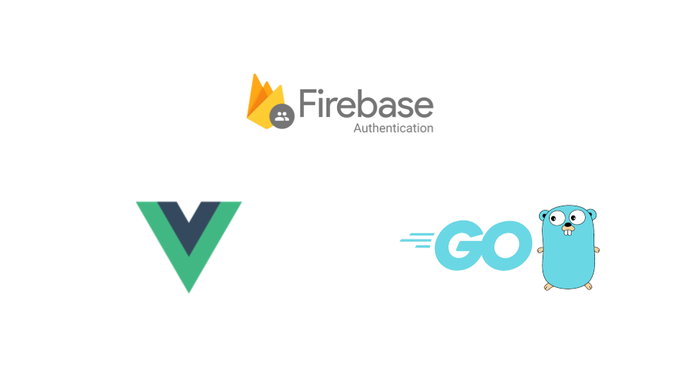
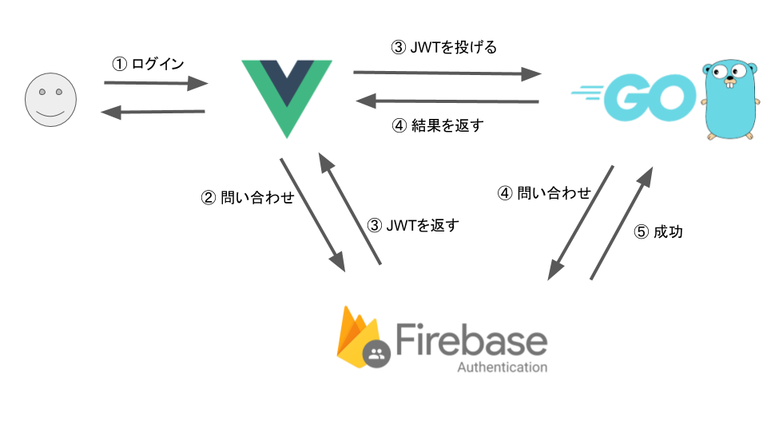

Vue.jsとGolangでWebアプリケーションでFirebase Authenticationを使い、ログイン処理を行います。  
https://firebase.google.com/docs/auth/?hl=ja  



Firebaseの説明や導入などは、Qiitaにもわかりやすい記事がたくさん上がっているので、そちらを参考にしてください。 

## Vue.js側
VueCLI3を使い、typescriptのプロジェクトを作成します。今回は、vueのrouter guardは省略します。

### 準備
npmからインストールします。 

```bash
$ npm install firebase
```

firebaseの認証情報は、以下のドキュメントを参考に取得しておきます。  
https://firebase.google.com/docs/auth/web/password-auth?authuser=1

`src/main.ts`にfirebaseをimportし、上記で取得した認証情報を貼り付けます。 

```typescript
import firebase from 'firebase/app';

const fireBaseConfig = {
  apiKey: '*****',
  authDomain: '*****.firebaseapp.com',
  databaseURL: 'https://******.firebaseio.com',
  projectId: '*****',
  storageBucket: '*****.appspot.com',
  messagingSenderId: '******',
};

firebase.initializeApp(fireBaseConfig);
```

### ログイン処理
firebaseではemail+passwordの通常の認証に加え、GoogleアカウントやTwitter、Githubのアカウントでのログインが1つのメソッドだけで行えます。 

Googleなどのアカウントでログインしたい場合は、あらかじめfirebaseから認証を許可するよう設定しておく必要があります。 

#### signIn with email+password
コンポーネントにfirebaseのログイン画面を作ります。以下はその例です。 

```typescript
import {Component, Vue} from 'vue-property-decorator';
import firebase from 'firebase/app';

@Component
export default class Home extends Vue {
  private email: string = '';
  private password: string = '';
  private showPassword: boolean = false;

  private siginInWithEmail() {
    firebase.auth().signInWithEmailAndPassword(this.email, this.password)
            .then((res: firebase.auth.UserCredential) => {
              if (res.user === null) {
                return new Promise<string>((_, reject) => reject('user not found'));
              }
              return res.user.getIdToken();
            })
            .then((idToken: string) => alert("login success"))
            .catch((err) => console.log(err))
            .finally(() => console.log('end'));
  }
```

見て分かる通り、以下のメソッドの引数にメールアドレスとパスワードを渡すだけです。  
`firebase.auth().signInWithEmailAndPassword(this.email, this.password)`

このメソッドは、`Promise<firebase.auth.UserCredential>`を返します。 User情報などはここから取得できます。 

UserCredentialの中身は以下のドキュメントを参考。  
https://firebase.google.com/docs/reference/js/firebase.auth.html#usercredential

`firebase.auth.UserCredential`のもつ`user`が`getIdToken`メソッドを持っており、ここからトークンが取得できます。 

PWAやスマホアプリでは、リフレッシュトークンを使いたいです。`getIdToken`では、トークンが失効していれば、firebase側でリフレッシュトークンを使ったトークンの更新処理を行ってくれるため、わざわざトークンの更新処理を追加する必要がありません。 


https://firebase.google.com/docs/reference/js/firebase.User.html#getidtoken

#### signIn with Google(popup)
ログイン方法には、Popupで別ウィンドウが開きログインを行う方法とリダイレクトを用いた方法があります。 Googleアカウントを使いpopupでログインしたい場合は、以下のようにします。 

```typescript
  import {Component, Vue} from 'vue-property-decorator';
  import firebase from 'firebase/app';
  
  private provider = new firebase.auth.GoogleAuthProvider();
  
  @Component
  export default class Home extends Vue {
    private signInByGoogleWithPopup() {
        firebase.auth().signInWithPopup(this.provider)
                    .then((res: firebase.auth.UserCredential) => {

        // 省略
```

providerにGoogleを指定し、`firebase.auth().signInWithPopup(this.provider)`を呼ぶと、popupで見慣れたログイン画面が表示されます。 
図

`firebase.auth().signInWithPopup(this.provider)`もEmail+Passwordの場合と同様に、`Promise<firebase.auth.UserCredential>`を返すので、同様の方法でtokenやuser情報を取得できます。 

#### signIn with Google(redirect)
PWAでは、リダイレクトでのログインが推奨されています。 

リダイレクトは以下のようにします。

```typescript
  private siginInByGoogleWithRedirect() {
    firebase.auth().signInWithRedirect(this.provider)
            .catch((err) => {
              console.log(err);
            })
            .finally(() => {
              console.log('end');
            });
  }
```

`siginInByGoogleWithRedirect`が呼ばれるとログイン画面にリダイレクトされます。

ログイン画面から元のページへ遷移後、リダイレクトによる認証が正しく行えたか確認します。 

```typescript
 private afterRedirect() {
    firebase.auth().getRedirectResult()
              .then((res: firebase.auth.UserCredential) => {
              // 省略
```

`getRedirectResult`が`firebase.auth.UserCredential`を返すので、正しく認証できていれば、ここから先ほどと同様にユーザー情報やトークンを取得できます。 


#### github or twitter
Googleアカウントを使った場合と同様に、プロバイダを指定しログインできます。
予めTwitterでデベロッパーアプリケーションとしてアプリを登録し、APIキーとAPI Secretを取得しておきます。
Twitterデベロッパー側に、OAuthコールバックとして、firebaseのURLを指定します。

```typescript
provider = new firebase.auth.GithubAuthProvider();
// or 
provider = new firebase.auth.TwitterAuthProvider();

firebase.auth().signInWithPopup(provider)
```

https://firebase.google.com/docs/auth/web/github-auth?hl=ja
https://firebase.google.com/docs/auth/web/twitter-login?hl=ja
 
### パスワードの再設定
パスワードの再設定のメールを送信するのも、メソッド1つで行えます。 

```typescript
firebase.auth().sendPasswordResetEmail(this.email)
```

送信されるメールのbodyは、firebaseから設定が行えます。 

ユーザーの更新、削除も同様に行えます。
詳しくはドキュメントを参考。 

https://firebase.google.com/docs/auth/web/manage-users?hl=ja#top_of_page

### メールアドレスの重複
Firebase Authenticationでは、メールアドレスの重複はデフォルトでは許可されていません。 Email+Passwordでアカウントを作成し、同じメールアドレスのGoogleアカウントでログインしようとすると、Googleアカウント側が有効となります。 このとき、ユーザー識別子は、Email+Passwordで作成したものが、Googleアカウントで作成したものに移行されるようです。 

重複を許可する設定も行えますが、1つのユーザーに複数のプロバイダを紐づけることもできるので、そちらを行った方が良いかと思います。 
https://firebase.google.com/docs/auth/web/account-linking

### 認証状態の永続性

https://firebase.google.com/docs/auth/web/auth-state-persistence?hl=ja

## Golang側
フロントで取得したJWTを、バックエンドに投げ、バックエンドからJWTが正しいかをfirebaeに問い合わせに行きます。  
ユーザーのログインのフローは簡単に書くと以下の図のような流れになります。  



コード例は、以下の用になります。  

```go
ctx := context.Background()
var opt option.ClientOption

// localのjson keyから認証する場合
opt = option.WithCredentialsFile("****.json")

// 環境変数から認証する場合
credentials, err := google.CredentialsFromJSON(ctx, []byte(authKey))
if err != nil {
        fmt.Println(err.Error())
	 os.Exit(1)
}
opt = option.WithCredentials(credentials)
		

app, err := firebase.NewApp(context.Background(), nil, opt)
if err != nil {
        fmt.Println(err.Error())
	 os.Exit(1)
}

client, err := app.Auth(context.Background())
if err != nil {
        log.Fatalf("error getting Auth client: %v\n", err)
	 os.Exit(1)
}

// ヘッダーからIDトークンを取得
authHeader := c.GetHeader(("Authorization"))
idToken := strings.Replace(authHeader, "Bearer ", "", 1)

// トークンを確認
token, err := client.VerifyIDToken(context.Background(), idToken)
if err != nil {
        log.Fatalf("error verifying ID token: %v\n", err)
}

log.Printf("Verified ID token: %v\n", token)
```

参考
https://firebase.google.com/docs/auth/admin/verify-id-tokens?hl=ja


## まとめ
Vue.jsとGolangからFirebase Authenticationを使いユーザーの管理を行いました。
これまで、ユーザー管理用のAPIを自分で書いていましたが、バックエンドもフロントエンドも少しコードを書くだけで認証が行えるfirebase、めっちゃ楽、すばらしいです. 

一方、firebaseは認証トークンにJWT(json web token)を使っており、JWTは使うべきでないというような記事も割と見かけるので、この辺りはもう少し詳しく調べて見ようかと思います。 
