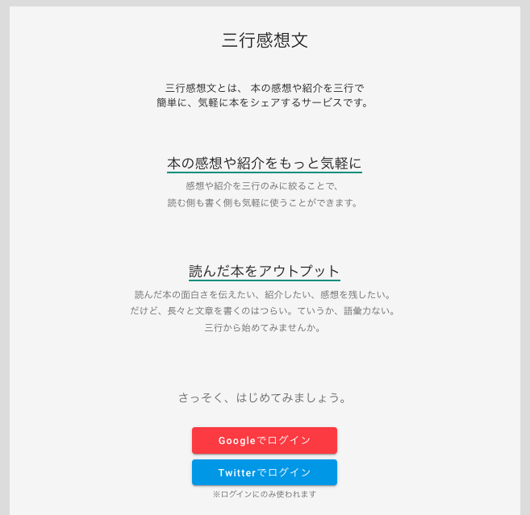
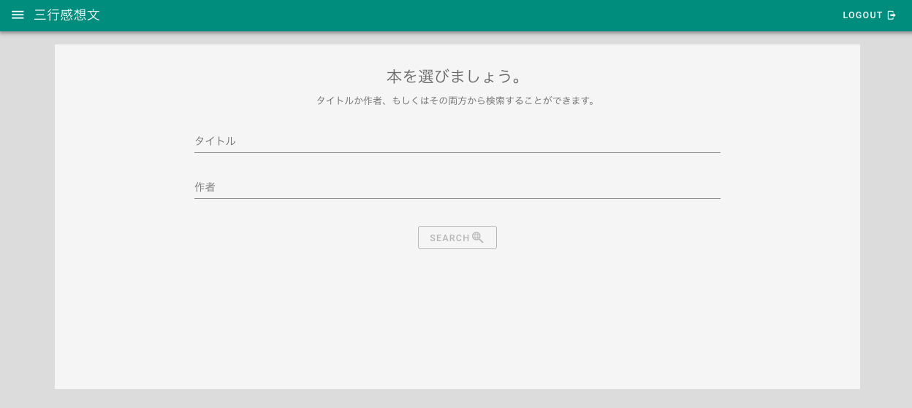
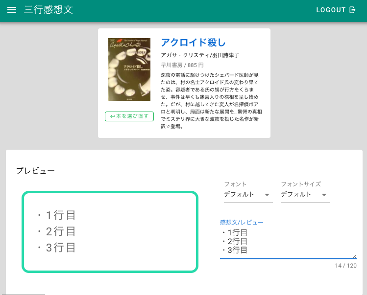
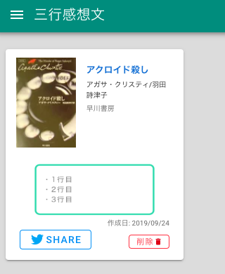

## サービス概要
「読書感想文をもっと気軽に」をコンセプトに読んだ本の感想文/レビューを三行だけ書き、SNSでシェアするサービスです。

[三行読書感想文](https://bookreports.edgwbs.net)

## 使い方
googleアカウントもしくは、Twitterアカウントでログインできます。  
その他のSNSアカウントでのログインは、随時対応していこうと思います。  

ログイン後に、感想を書く本を選びます。

あとは、感想を書き、保存します。

保存後にシェアします。

これだけの単純な作りです。

## 作った動機
- Firebaseを使いたかった
- 本に出会える場を増やしたかった

#### 1.Firebaseを使いたかった
単純にFirebaseのみでサービスを稼働させたかっただけです。これまでFirebase Authは使ったことがありました。これがすごく便利で、びっくりしました。今まで、アカウント管理のAPIを頑張って作ってたのを肩代わりしてくれるなんて。そこで、それ以外のサービスを使ってみようと言うのが動機です。  
今回、Webアプリケーションで使えるDBやStorage、HostingなどFirebaseのサービスはほぼ使っています。すごく便利。使ってみた技術は、別の記事にまとめます。  

#### 2.本に出会える場を増やしたかった
個人的な意見として、本とのファーストコンタクトは、タイトルや表紙、帯に書いてあるコメントなどパッと目に入ってくるものが多いです。本の感想やレビューを三行に絞ることで、書く側も読む側も気軽に使え、新たな本に出会える場となるのではないかと考えました。普段、本を読むことが少ない人は、こういった気軽な出会いから本を読んでみるのも良いのではないかと思います。  

また、本を多く読む人も、多く読むからこそ、この本読んだけどどんな話だっけ？となることが多いかと思います。  
そういった場面で、短く感想を残しておくことで、自分自身の読んだ本の記録にもなるかと思います。  

## まとめ
Firebaseを使うことで、実質コーディングしたのは、フロントのVue.jsだけでした。DBやストレージへのアクセス、アカウント管理周りなどをFirebaseに任せられることで、APIを書く必要がないのは、コーディングする上で大きな負荷の軽減となりました。無料でここまで使わせてくれるのは、なにかサービスを簡単に始めたい時はとても便利だと思います。

