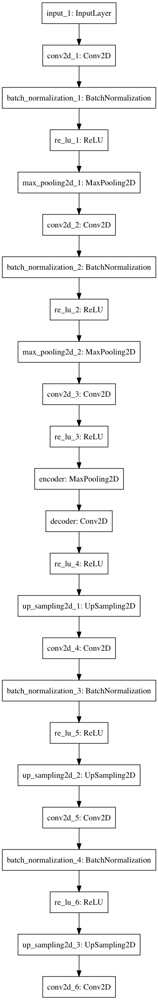
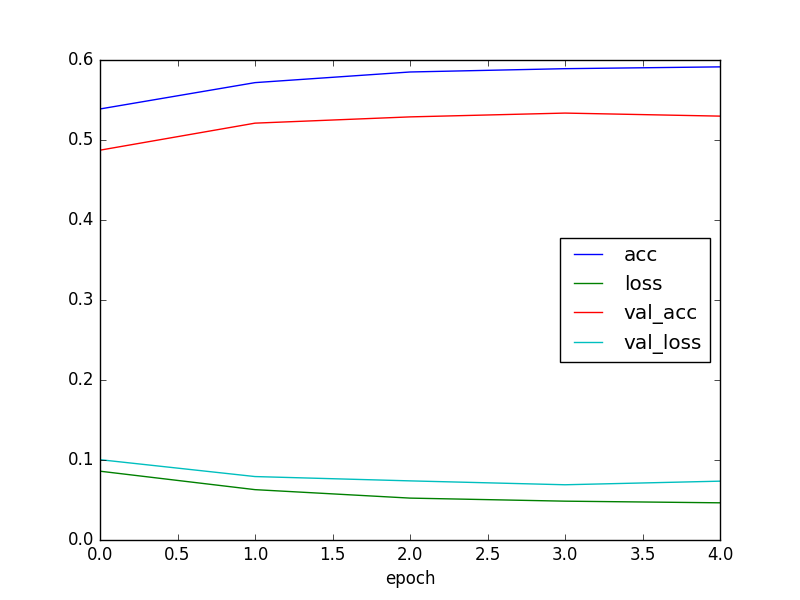
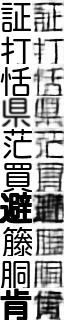
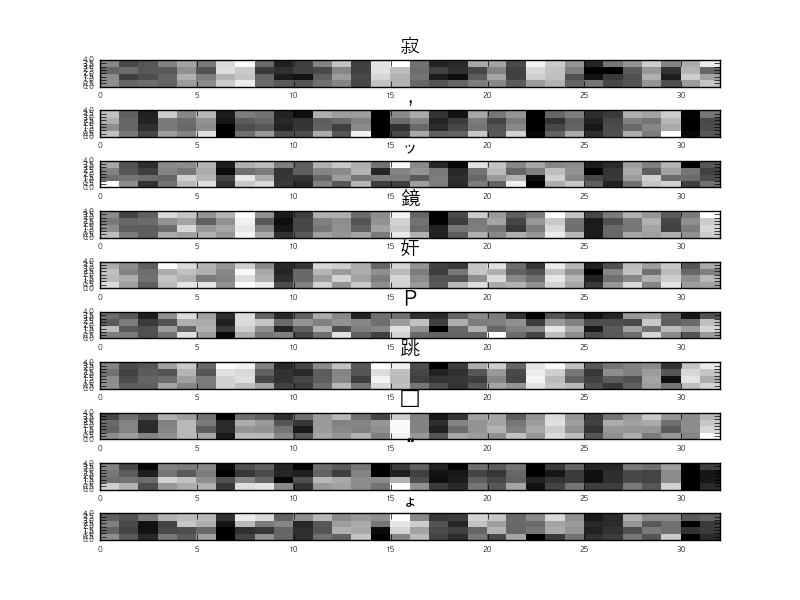

文章生成にchar-level lstmを使ってみる。英語ではうまくいっている例があるが日本語では難しい。これは、日本語は英語に比べ文字数が多く、ニューラルネットワークの次元数(パラメータ数)が増やす必要があるのが原因の1つだと思う。また、次元削減のため、日本語では文章を単語に区切り単語をベクトル化し、lstmで文章を生成する手法もあるが、単語に区切る時点でしゃべり言葉やネットの言葉ではうまく区切れないという問題がある。そこで、日本語の文字を画像として生成し、その画像をauto-encoderを用いてベクトル化することで、文字のベクトル化を行い、lstmに食わせるという手法を試して見ようと思う。  
今回は、auto-encodeを用いた文字レベルのベクトル化までを行ってみようと思う。  
コードはここ、https://github.com/if001/fifc.git  

以下の3工程で行う。

- フォントファイルからフォント画像を生成
- 文字列とフォント画像をマッピング
- フォント画像から特徴量を生成


## フォントファイルからフォント画像を生成
フォントファイルは、PILのImageFontの[turetype](https://pillow.readthedocs.io/en/3.0.x/reference/ImageFont.html#PIL.ImageFont.truetype)を使い読み込むことができる。  
フォントファイルとフォントのサイズを引数に与えることで、fontオブジェクトが生成できる。  

```python
from PIL import ImageFont
font_size=28
font = ImageFont.truetype(font_file, font_size, encoding='unic')
```

読み込んだフォントは下記のように保存する。  

```python
from PIL import Image
pict_height=28
pict_width=28
image = Image.new('RGB', (pict_height, pict_width), (255, 255, 255))
draw = ImageDraw.Draw(image)
draw.text(pos, yomi, font=font, fill='#000000')
image.save("./font", 'PNG')
```

```
Image.new()
```
で空のイメージを生成し、

Drawオブジェクトに対しの[text関数](https://pillow.readthedocs.io/en/3.0.x/reference/ImageDraw.html#PIL.ImageDraw.PIL.ImageDraw.Draw.text)を用いてフォントファイルを書き込む。

```
draw.text(pos, yomi, font=font, fill='#000000')
```

引数は、上記のtext関数のリンクを参照。  

保存するファイル名は、以下のように文字を16進数変換したものを使う。

```python
yomi="歩"
bytes_yomi = yomi.encode("UTF-8").hex()
>> 'e6ada9'
```

## 文字列とフォント画像をマッピング
ファイル名を読み仮名を16進数変換し保存しているので、文字から毎回画像ファイルを読み込んでも良いが、高速に呼び出せるように、1文字と画像をファイルとkvsを使ってマッピングしておく。  
kvsにはplyvelを使う。以下のようにインスタンス化する。

```python
import plyvel
db = plyvel.DB(db_path, create_if_missing=True)
```

以下のように、保存と取り出しを行う。

```python
db.put(key, value) # 保存
db.get(key) # 取り出す
```

## フォント画像から特徴量を生成
auto-encoderを使って、保存した画像から特徴量を抽出する。  
モデルの構造はkerasの公式ブログを参考にし、以下の構造とした。  



各層の次元は以下のようにした。

```python
font_size = 32
input_img = Input(shape=(font_size, font_size, 1))

x = Conv2D(16, (3, 3), padding='same')(input_img)
x = BatchNormalization()(x)
x = ReLU()(x)
x = MaxPooling2D((2, 2), padding='same')(x)

x = Conv2D(8, (3, 3), padding='same')(x)
x = BatchNormalization()(x)
x = ReLU()(x)
x = MaxPooling2D((2, 2), padding='same')(x)

x = Conv2D(self.hidden_dim, (3, 3),
           padding='same')(x)
x = ReLU()(x)
encoded = MaxPooling2D((2, 2), padding='same', name="encoder")(x)

x = Conv2D(8, (3, 3), padding='same', name="decoder")(encoded)
x = ReLU()(x)
x = UpSampling2D((2, 2))(x)

x = Conv2D(8, (3, 3), padding='same')(x)
x = BatchNormalization()(x)
x = ReLU()(x)
x = UpSampling2D((2, 2))(x)

x = Conv2D(16, (3, 3), padding='same')(x)
x = BatchNormalization()(x)
x = ReLU()(x)
x = UpSampling2D((2, 2))(x)

decoded = Conv2D(1, (3, 3), activation='sigmoid', padding='same')(x)

autoencoder = Model(input_img, decoded)
autoencoder.summary()
```

### 学習
損失関数と最適化関数はそれぞれ、mean_squared_errorとadamを用いた。  

教師データとバリデーションデータはそれぞれ、66918個、16730個とした。また、バッチサイズは128とした。  
学習は、kerasのearlystoppingを使いval_lossが減少がなくなるまで行った。  

### 結果



最中的なスコア   

```
epoch :4  
acc :0.591411  
loss :0.046486  
val_acc :0.529843  
val_loss:0.073542  
```

だいぶ早めに学習が打ち切られているのがわかる。  
2epoch目くらいからほとんどlossもaccも変化しなくなっている。次元数や層の数が少なくパラメタが足りないのか???

一応デコードされた文字を確認しておく。  



左が教師データ、右がdecodeされた文字となる。auto-encoderなのでぼやけているのはしょうがないが割と綺麗にデコードできている。ただし、画数の多い文字となるとやはりぼやけて元の文字がわからない。この辺は、モデルや学習のパラメタを調整することでも少し改善されると思う。  

生成された特徴量も確認しておく。  
以下に、'寂', ',', 'ッ', '鏡', '奸', 'Ｐ', '跳', '・', '“', 'ょ'の記号を含む10文字を与えた際の特徴量を図示する。
特徴量は、1文字あたり(4,4,8)次元となるので、4×4の画像を8枚横に並べたものを表示している。  



図をみると、文字ごとの偏りはなく学習できているように見える。

lossは0.04とある程度小さい値となったが、accは0.6とそこまで高い値とはならなかった。改善のため何をすれば良いかの指標がいまいちわからん。損失関数と最適化関数は良さそうなので、とりあえず、層の数やunit数、学習率などのパラメタや教師データを増やすなど試してみようと思う。随時更新していく。


