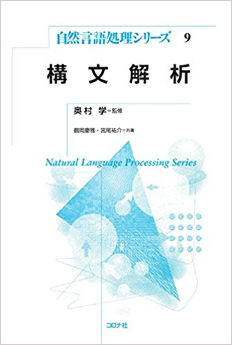

## はじめに
自然言語処理シリーズの構文解析を読んでいきます。

全体の概要把握:1時間
中身の細かいとこ：3時間
という感じで読み進めて行こうと思います。

## 概要
構文解析を用いることで、単語の並びの背後にある文法的な構造を明らかにすることができる。構文解析を学ぶことで、自然言語処理で用いられる様々な先人の知恵を学習できる。

この本では以下のような構成となっている。

- 1章、はじめに
- 2章、品詞タグ付けのための手法と、機械学習の基礎的な事項について
- 3章、句構造解析について
- 4章、依存構造解析
- 5章、文法理論、深い構文解析
- 6章、構文解析の応用例
- 7章、構文解析ツールの紹介
- 8章、モデルやアルゴリズムの学習用・評価用データに用いられるツリーバンクの紹介

以下、各章の概要まとめです。

## 2章：品詞解析と機械学習
品詞解析のためのさまざまな技術の解説し、その基盤となる機械学習の考え方と代表的なモデルを紹介する。

品詞タグ付け：与えられた文章の各単語の品詞を判定し、品詞情報を付与する処理
品詞タガー：品詞タグ付けを行うプログラム
ルールベースの手法：shoudの後には動詞がくると決めうちでタグ付けをする手法
素性: 品詞判定の手がかりとして利用する情報

#### 隠れマルコフモデル
機械学習に基づく品詞タグ付け手法の中で基本的なもの。
単純な計算では、文長に対し計算量が指数関数的に増加する問題がある。

#### Viterbiアルゴリズム
計算量増加の問題を解決。動的計画法の1種。
アンダーフローの問題がある、この問題に対し、対数をとっても良いが計算が遅くなるというデメリットもある。

#### 最大エントロピーモデル
最大エントロピーモデルは、品詞判定に役立つ手がかりを素性として利用し予測できるアルゴリズムの一種。品詞の前後のつながりを考慮せずに予測するというモデル。
計算コストは少ないが、素性を柔軟に設計できないため精度が低いという問題点がある。
自然言語処理では、実装が簡単なことからSGDがよく用いられる。学習データの数が多い場合には、短時間で最適化を行うことができる。

#### 最大エントロピーマルコフモデル
最大エントロピーモデルに、品詞のつながりを考慮させ正確な予測を行うことできるように改良されたモデル。
先行する単語の品詞に関数情報を素性として利用するできるが、最初にタグ付けを間違えると、その誤りによって別の誤りが引き起こされてしまう問題がある。

#### 条件付き確率場(CRF)
各単語の品詞を個別に予測するのではなく、文全体の品詞列全体を一度に予測しようとするアプローチに基づく代表的な確率モデル。

#### 構造化パーセプトロン
CRFでは、登場する品詞列すべてに対し確率を求めるが、もっとも正解である確率の高い品詞列さえ得られれば良いという状況もある。そのような状況では、構造化パーセプトロンが役にたつ。動的計画法を用いて品詞タグ付けを行う。

#### ビーム探索
構造化パーセプトロンでは動的計画法を用いて品詞タグ付けを行ったが、素性が局所的な場合には、動的計画法が使えない。そこで、非局所的な様々な素性を利用するためによく用いられるのがビーム探索である。似たような手法として、Max Violationがある。

#### 生コーパスを利用した学習
これまでの学習は、コーパスを前提にしたものだった。しかしコーパスの構築には膨大な時間がかかる。与えられた文章のみで学習する手法を、半教師あり学習と呼ぶ。

#### 自己学習
生コーパスを用いる学習に自己学習と呼ばれる方法がある。
これは、CRFや構造化パーセプトロンでは精度向上に効果がないが、隠れマルコフモデルのような生成モデルでは大きな精度向上を得ることができる。これは、生成モデルの場合、EMアルゴリズムの1ステップに対応しているからである。隠れマルコフモデルで自己学習を行う場合、Baum-Welchアルゴリズムを用いる。

## 3章：句構造解析
構文解析の表現方法の1つである句構造と、それに基づく構文解析の手法について説明する。

#### 句構造
文中の句同士の包含関係を階層的にまとめあげることで、その構造を明らかにする。
適切な句構造を得るための問題を2つに分けると、与えられた文に対して文法上可能な全ての句構造を計算することと、それらの中から最も適切な句構造を選択することとなる。

#### 文脈自由文法
文の句構造を表現するための、最も基本的な文法の一つ。
文脈自由文法のためのボトムアップな構文解析手法の一つであるCKY法と、任意の文脈自由文法を用いてトップダウンに構文解析を行うことが可能なEarly法がある。

#### 確率文脈自由文法(PCFG)
句構造を列挙した上で、最も確からしい句構造を選択する枠組みの1つ

#### 確率文脈自由文法(PCFG)の拡張
PCFGを拡張した、Collins Parserの手法について解説
生成的な確率モデルを注意深く設計することで、正しい構文木にたいして大きな確率がわりあてられるようにする。

#### 識別モデルによる際順位付け
正しい構文木とそうでない構文木を区別する特徴はいくつかあるが、Collins Parserでは限られたものしか考慮することができない。

#### 評価法
句構造解析の精度の評価には、構文木を構成する句の適合率(precision)と再現率(recall)がよく用いられる。

## 4章:依存構造解析
依存構造とは、文中の単語間の関係をグラフで表したものである。

#### CKY法
依存構造を句構造だと考え解析する。

#### Eisner法
同じ出力を得るための解析プロセスが複数存在することを、擬似曖昧性と呼ぶ。
依存構文解析において、擬似曖昧性が生じないようにCKY法を改良したものがEisner法である。

#### MST法
これまでの手法は、句構造解析のアルゴリズムを依存構造解析に応用したものであったが、依存構文解析に特有の手法として、最大全域木(MST)法を応用したものが知られている。
最大全域木とは、エッジにスコアが与えられたグラフを入力として、全ノードを被覆する木(=全域木)のうち、スコアのわが最大となるものを求めるアルゴリズムである。

#### 遷移型依存構造解析
句造像解析と同様のアルゴリズムを依存構造解析でも考えることができる。

#### 日本語構文解析
p102(スキップ)

#### 評価法
依存構造解析の評価には、ラベル付きかかり受け精度およびラベルなしかかり受け精度が用いられる。

## 5章：文法理論、深い構文解析
3、4章で解説した、句構造・依存構造では明示されない意味的構造をも計算する、構文解析のことを、**深い構文解析**と呼ぶ。

#### 組み合わせ範疇文法(CCG)
組み合わせ範疇文法(CCG)とは、各単語にその文法機能を表すカテゴリを与え、そのカテゴリを組み合わせることで文の構造を計算する。

#### 主辞駆動句構造文法(HPSG)
主辞駆動句構造文法(HPSG)とは、主辞(句の中で意味的もしくは文法的に中心的な役割を果たす語)が持つ文法機能を素性構造というデータ構造で表し、それに基づき文全体の構造を決定する文法理論である。素性構造では、C++の構造体やオブジェクト指向言語におけるクラスに似た形でデータを表す。

#### 深い構文解析
CCGやHPSGのような文法理論を用いて、CFGより多くの情報をもたせた文法構造を解析する手法を深い文法構造と呼ぶ。

