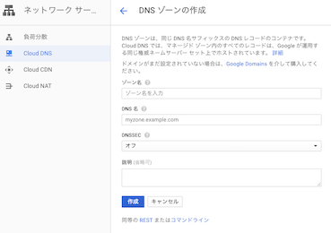
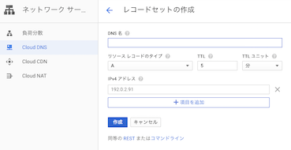

## はじめに
GCE上にdockerコンテナを使って、hugoの静的ファイルを公開してます。

いろいろwebサービスを作ったりはしますが、公開するのは初めてだったので、いろいろと苦労した点をまとめておきます。

## インフラ
GCEを使います。ほんとは、image化してインスタンスグループで公開したかったのですが、とりあえず、コンテナをVM上にデプロイすることにします。

## ドメイン
ドメインは、お名前.comで取得します。これは特に説明なしでいけます。

DNSは、route53を使いたかったんですが、今回はgoogleのcloud DNSを使います。

Google Cloud Consoleから、「ネットワークサービス」→「Cloud DNS」を選択します。

任意のゾーン名、取得したドメイン、(説明)を入力して作成。



### Aレコードの登録
DNS名には、www.取得したドメイン、リソースタイプにはAレコードを設定し、作成します。



### レジストラへの登録
生成されるNSレコードの`ns-cloud-c1.googledomains.com.`をお名前.com側に登録します。

## https化
let's encryptを使ってhttps化しようと思っていたところ便利なものを発見したのでこちらを使います。

[https-portal](https://github.com/SteveLTN/https-portal)

自動で証明書の更新も行ってくれます。すごい。便利。

親切にdocker-composeが公式に載せてあるので、参考にします。
docker-composeのインストールはpipなどで行ってください。

```yaml
https-portal:
  image: steveltn/https-portal:1
  ports:
    - '80:80'
    - '443:443'
  links:
    - wordpress
  restart: always
  environment:
    DOMAINS: 'wordpress.example.com -> http://wordpress:80'
    # STAGE: 'production'
    # FORCE_RENEW: 'true'

wordpress:
  image: wordpress
  links:
    - db:mysql

db:
  image: mariadb
  environment:
    MYSQL_ROOT_PASSWORD: '<a secure password>'
```

imageのバージョンは:1と指定しましょう。最新版を取ってくるようになります。

```
image: steveltn/https-portal:1
```

1.2以下だと、let's Encryptで証明書を取得する際にエラーが起きるので注意です。

```yaml
links:
- wordpress
```
linksで公開するサービス名を指定しましょう。


```yaml
environment:
	DOMAINS: 'wordpress.example.com -> http://wordpress:80'
```
環境変数のDMAINSでは、リクエストを受けるドメイン -> https化したいエンドポイントを指定します。

linksで指定したエイリアスで指定できます。また、->を=>に変更することでリダイレクトができます。


STAGEは、次の3つが指定できます。

- `STAGE: 'local'`でオレオレ証明書を作成します。テストなどに
- `STAGE: 'staging'`でテスト用の証明書を作成します。
- `STAGE: 'production'`で本番用に、Let's Encryptで正式な証明書を作成します。


その他、環境変数も指定できます。この辺りを参考しながら、設定を行います。
https://github.com/SteveLTN/https-portal/tree/master/fs_overlay/var/lib/nginx-conf

